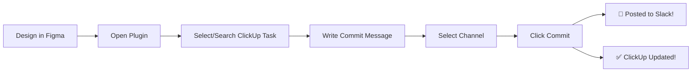

# 🎨 Figma to Slack Notifier

> Share final design updates to Slack with ClickUp task integration — streamlined, professional, and automated.

[](https://www.figma.com)
[](https://slack.com)
[](https://clickup.com)
[](https://vercel.com)

---

## ✨ Features

<table>
<tr>
<td width="50%">

### 🏷️ **Streamlined Format**
Professional "Final Design" format:
- ✅ **Consistent messaging** - Clear, professional updates
- 📋 **Task-focused** - Links to ClickUp tasks
- 🎯 **Final design delivery** - Ready for review & handoff
- 🔗 **Context-rich** - Includes Figma & ClickUp links

</td>
<td width="50%">

### 👥 **Team Collaboration**
- 🔍 **User Autocomplete** - @mention teammates
- 📢 **Channel Selection** - Post to any channel
- 💬 **Rich Descriptions** - Formatted text editor
- 🔗 **Direct Links** - Jump straight to Figma

</td>
</tr>
<tr>
<td width="50%">

### 🤖 **Smart Detection**
- 📄 Auto-detects file name
- 📑 Captures current page
- 🎯 Tracks selected elements
- ⏰ Timestamps everything

</td>
<td width="50%">

### 🔗 **ClickUp Integration**
- 🎯 **Task Linking** - Connect commits to ClickUp tasks
- 🔄 **Auto-Update** - Update task status & fields
- 🔍 **Task Search** - Find tasks by name
- 📋 **Smart Filter** - Show only in-progress tasks

</td>
</tr>
<tr>
<td width="50%">

### 🚀 **Zero Deployment Required**
- 💾 Uses official shared backend
- 🔄 One-time Slack & ClickUp setup
- ⚡ No Vercel account needed
- 🌐 Works for all users instantly

<sub>*All users share the same backend infrastructure</sub>

</td>
<td width="50%">

### 🛡️ **Security & Privacy**
- 🔐 Encrypted token storage
- 🔒 OAuth 2.0 authentication
- 🚫 No data tracking
- ✅ SOC 2 compliant backends

</td>
</tr>
</table>

---

## 📸 Screenshots

<!-- TODO: Add screenshots here -->
> **Coming soon!** Screenshots of the plugin in action.

### Plugin Interface
<!--  -->

### Slack Message Example
<!--  -->

### Settings Panel
<!--  -->

---

## 🚀 Quick Start

### For End Users (Recommended)

**⚡ 3-Minute Setup - No Deployment Required!**

The plugin uses a **shared official backend** - just install and connect your accounts:

1. **Install the plugin** in Figma:
   - Download or clone this repository
   - In Figma: `Plugins → Development → Import plugin from manifest`
   - Select `manifest.json`

2. **Configure Slack** (one-time setup):
   - Create a Slack App at [api.slack.com/apps](https://api.slack.com/apps)
   - Add OAuth Scopes: `channels:read`, `groups:read`, `users:read`, `users:read.email`, `chat:write`, `incoming-webhook`
   - Install to your workspace and copy the Bot Token
   - Paste token in plugin settings → Fetch users & channels

3. **Connect ClickUp** (one-click):
   - Click "Connect ClickUp" in plugin settings
   - Authorize access to your workspace
   - Select folders to pull tasks from
   - Done! 🎉

4. **Start posting!** All commits now include ClickUp task links and auto-update task status

👉 **Detailed guides:**
- [Slack Setup Guide](./SETUP_GUIDE.md) - Complete Slack app creation steps
- [User Guide](./USER_GUIDE.md) - How to use the plugin

---

### For Developers (Self-Hosting)

Want to run your own backend or contribute? See [CONTRIBUTING.md](./CONTRIBUTING.md) for:
- Local development setup
- Deploying your own Vercel instance
- Architecture overview
- How to contribute

---

## 🎯 How It Works


```mermaid
graph LR
    A[Design in Figma] --> B[Open Plugin]
    B --> C[Select/Search ClickUp Task]
    C --> D[Write Commit Message]
    D --> E[Select Channel]
    E --> F[Click Commit]
    F --> G[🎉 Posted to Slack!]
    F --> H[✅ ClickUp Updated!]
```

1. **Make design changes** in Figma
2. **Open the plugin** (Plugins → Figma Updates to Slack)
3. **Select Slack channel** - Choose where to post
4. **Link ClickUp task** - Search and select your task (required)
5. **Add Figma link** - Paste your Figma file URL
6. **Write description** - Detail what's been completed
7. **Acknowledge team members** - Tag who needs to see this
8. **Click "Post to Slack"** - Your team sees it instantly, and ClickUp is auto-updated

---

## 💬 Example Slack Message

```
✅✅✅✅✅
FINAL DESIGN FOR: [ClickUp Task Name] + Description

📋 ClickUp Task: [ClickUp Task Name]
🔗 ClickUp Link: [Link to task]

🎨 Figma Link: [Link to Figma file]

📝 Description:
• Design revisions based on stakeholder feedback
• Updated color palette to match brand guidelines
• Improved mobile responsiveness for tablet view
• Added interactive prototypes for user testing

Acknowledged by: @jane, @john
CC: @design-team

━━━━━━━━━━━━━━━━━━━━━
🕐 Nov 28, 2025 at 3:45 PM
```

**Note:** The plugin uses a clean "FINAL DESIGN FOR:" format for all design updates, ensuring consistency and professionalism in team communications.

---

## 🛠️ Technology Stack

- **Frontend**: Vanilla JavaScript + HTML/CSS
- **Backend**: Node.js serverless functions (Vercel)
- **APIs**:
  - Slack Web API + Slack Webhooks
  - ClickUp API (OAuth 2.0)
- **Storage**: Figma Client Storage (encrypted)
- **Deployment**: Vercel (auto-deploys from GitHub)
- **Authentication**: OAuth 2.0 for ClickUp integration

---

## 📁 Project Structure

```
figma-updates-to-slack-plugin/
├── 📄 manifest.json                      # Plugin configuration
├── 📄 code.js                            # Main plugin logic
├── 📄 ui.html                            # Plugin interface (HTML/CSS/JS)
├── 📄 package.json                       # Dependencies
├── 📁 figma-slack-bridge/               # Backend serverless functions
│   └── 📁 api/
│       ├── fetch-slack-users.js         # Fetch team members
│       ├── fetch-slack-channels.js      # Fetch channels
│       ├── send-to-slack.js             # Send messages
│       ├── clickup-authorize.js         # ClickUp OAuth initiation
│       ├── clickup-callback.js          # ClickUp OAuth callback
│       ├── clickup-workspaces.js        # Fetch ClickUp workspaces
│       ├── clickup-folder-lists.js      # Fetch ClickUp folders/lists
│       ├── clickup-tasks.js             # Fetch ClickUp tasks
│       ├── clickup-update-status.js     # Update task status
│       └── clickup-update-custom-fields.js # Update task custom fields
├── 📄 SETUP_GUIDE.md                    # Slack setup instructions
├── 📄 CLICKUP_SETUP.md                  # ClickUp integration guide
├── 📄 TODO_FOR_PUBLIC_RELEASE.md        # Development checklist
└── 📄 README.md                          # This file
```

---

## 🔧 Development & Contributing

**👥 Want to contribute or self-host?** Check out [CONTRIBUTING.md](./CONTRIBUTING.md)

The official backend is hosted at `https://figma-slack-bridge.vercel.app` and serves all users. You only need local development if you're:
- Contributing new features or fixes
- Testing backend changes
- Running a private fork

For detailed setup instructions, architecture overview, and contribution guidelines, see the [Contributing Guide](./CONTRIBUTING.md).

---

## 🎨 Customization

### Add Custom Commit Types

1. Edit the commit types in `ui.html`:
```html
<button class="commit-type" data-type="DOCS" onclick="selectCommitType('DOCS', '📚')">
    📚 Docs
</button>
```

2. Reload the plugin

### Change Slack Message Format

Edit the `payload` structure in `ui.html` around line 800:
```javascript
const payload = {
    blocks: [
        {
            type: "section",
            text: {
                type: "mrkdwn",
                text: `${commitEmoji} *${commitType}:* ${taskName}`
            }
        }
        // Add more blocks...
    ]
};
```

Use [Slack Block Kit Builder](https://app.slack.com/block-kit-builder) to design your messages.

---

## 🐛 Troubleshooting

### Common Issues

| Issue | Solution |
|-------|----------|
| ❌ "Slack API error: invalid_auth" | Token expired. Get a new one from Slack and update in settings |
| ❌ "No channels found" | Invite your bot to channels in Slack first |
| ⏱️ "Rate limited" | Wait 1-2 minutes. Happens when clicking fetch too many times |
| 🌐 "Server offline" | Check internet connection. Vercel may be redeploying |
| 🔒 "Missing scope" | Add all required OAuth scopes and reinstall Slack app |

### Still Having Issues?

1. Check the [Setup Guide](./SETUP_GUIDE.md) troubleshooting section
2. Search [GitHub Issues](https://github.com/alfianimanuddin-design/figma-updates-to-slack-plugin/issues)
3. Create a new issue with:
   - What you were trying to do
   - Error message
   - Screenshots

---

## 🚦 Roadmap

**Current Version: 2.0.0**

### ✅ Completed
- [x] Core posting functionality
- [x] Streamlined "Final Design" format
- [x] User autocomplete & @mentions
- [x] Channel configuration
- [x] Rich text editor for descriptions
- [x] Backend API with rate limiting
- [x] **ClickUp OAuth integration** (required)
- [x] **Task linking & auto-update**
- [x] **Task search & filtering**
- [x] **Custom field updates**
- [x] Security improvements
- [x] Loading states & UI feedback
- [x] Required field validation

### 🔄 In Progress
- [ ] First-time user onboarding
- [ ] Enhanced documentation
- [ ] Testing across platforms

### 📋 Planned
- [ ] Design screenshots in Slack
- [ ] Commit history & templates
- [ ] Dark mode
- [ ] Additional project management integrations (Jira, Linear, etc.)
- [ ] Figma Community release

See [TODO_FOR_PUBLIC_RELEASE.md](./TODO_FOR_PUBLIC_RELEASE.md) for full roadmap.

---

## 🤝 Contributing

Contributions are welcome! Here's how:

1. Fork the repository
2. Create a feature branch (`git checkout -b feature/amazing-feature`)
3. Commit your changes (`git commit -m 'Add amazing feature'`)
4. Push to the branch (`git push origin feature/amazing-feature`)
5. Open a Pull Request

---

## 📄 License

MIT License - See [LICENSE](./LICENSE) for details.

Feel free to use, modify, and distribute this plugin!

---

## 🙏 Acknowledgments

- Built with [Figma Plugin API](https://www.figma.com/plugin-docs/)
- Powered by [Slack API](https://api.slack.com/)
- Deployed on [Vercel](https://vercel.com)
- Inspired by Git commit conventions

---

## 🔗 ClickUp Integration (Built-in)

The plugin includes **seamless ClickUp integration** with zero configuration:

### ✨ Features
- **One-Click OAuth** - Connect your ClickUp account instantly
- **Task Linking** - Required for every commit (ensures accountability)
- **Auto-Population** - Task name becomes your commit title
- **Smart Filtering** - Only shows "in progress" tasks
- **Search** - Find tasks quickly by name
- **Auto-Update** - Updates task status & custom fields on post:
  - ✅ Design Link (Figma file URL)
  - ✅ Delivery Date (timestamp)
  - ✅ Custom fields (if configured in your ClickUp)

### 🚀 Setup (30 seconds)
1. Open plugin settings
2. Click **"Connect ClickUp"**
3. Authorize in ClickUp (one-time)
4. Select workspace & folders
5. Done! Tasks appear in dropdown

**No backend setup needed** - the plugin uses the official shared OAuth app.

See [How to Use ClickUp Integration](./CLICKUP_SETUP.md) for detailed features.

---

## 📞 Support & Community

- 📖 [Slack Setup Guide](./SETUP_GUIDE.md) - Complete Slack setup instructions
- 🔗 [ClickUp Integration Guide](./CLICKUP_SETUP.md) - ClickUp setup & features
- 🐛 [Report Issues](https://github.com/alfianimanuddin-design/figma-updates-to-slack-plugin/issues)
- 💡 [Request Features](https://github.com/alfianimanuddin-design/figma-updates-to-slack-plugin/issues/new)
- ⭐ [Star on GitHub](https://github.com/alfianimanuddin-design/figma-updates-to-slack-plugin)

---

<div align="center">

**Made with ❤️ for designers who love staying in sync**

[⬆ Back to Top](#-figma-to-slack-notifier)

</div>
