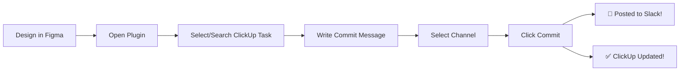

# 🎨 Figma Updates to Slack

> Share your design updates to Slack with beautiful, Git-style commit messages — right from Figma!

[](https://www.figma.com)
[](https://slack.com)
[](https://vercel.com)

---

## ✨ Features

<table>
<tr>
<td width="50%">

### 🏷️ **Git-Style Commits**
Choose from 5 commit types:
- ✨ **Feature** - New designs & components
- 🐛 **Fix** - Bug fixes & corrections
- 🔄 **Update** - Improvements to existing work
- 🎯 **Final** - Ready for handoff
- 👀 **Review** - Request feedback

</td>
<td width="50%">

### 👥 **Team Collaboration**
- 🔍 **User Autocomplete** - @mention teammates
- 📢 **Channel Selection** - Post to any channel
- 💬 **Rich Descriptions** - Formatted text editor
- 🔗 **Direct Links** - Jump straight to Figma

</td>
</tr>
<tr>
<td width="50%">

### 🤖 **Smart Detection**
- 📄 Auto-detects file name
- 📑 Captures current page
- 🎯 Tracks selected elements
- ⏰ Timestamps everything

</td>
<td width="50%">

### 🔗 **ClickUp Integration**
- 🎯 **Task Linking** - Connect commits to ClickUp tasks
- 🔄 **Auto-Update** - Update task status & fields
- 🔍 **Task Search** - Find tasks by name
- 📋 **Smart Filter** - Show only in-progress tasks

</td>
</tr>
<tr>
<td width="50%">

### 🚀 **Zero Configuration***
- 💾 Saves settings locally
- 🔄 One-time Slack setup
- ⚡ Instant deployment
- 🌐 Works everywhere

<sub>*After initial Slack app setup</sub>

</td>
<td width="50%">

### 🛡️ **Security & Privacy**
- 🔐 Encrypted token storage
- 🔒 OAuth 2.0 authentication
- 🚫 No data tracking
- ✅ SOC 2 compliant backends

</td>
</tr>
</table>

---

## 📸 Screenshots

<!-- TODO: Add screenshots here -->
> **Coming soon!** Screenshots of the plugin in action.

### Plugin Interface
<!--  -->

### Slack Message Example
<!--  -->

### Settings Panel
<!--  -->

---

## 🚀 Quick Start

### For Users

**📖 New to this?** Follow the complete [Setup Guide](./SETUP_GUIDE.md) for step-by-step instructions.

**⚡ Quick Setup (5 minutes):**

1. **Create a Slack App** at [api.slack.com/apps](https://api.slack.com/apps)
2. **Add these OAuth Scopes:**
   - `channels:read`, `groups:read`, `users:read`, `users:read.email`, `chat:write`, `incoming-webhook`
3. **Install the plugin** in Figma (Development → Import plugin from manifest)
4. **Configure in plugin settings:**
   - Paste your Slack Bot Token
   - Fetch your team members
   - Configure channels
5. **[Optional] Connect ClickUp:**
   - Link ClickUp tasks to commits
   - Auto-update task status and fields
   - See [ClickUp Setup Guide](./CLICKUP_SETUP.md)
6. **Start committing!** 🎉

👉 **Detailed guides:**
- [Slack Setup Guide](./SETUP_GUIDE.md)
- [ClickUp Integration Guide](./CLICKUP_SETUP.md) (Optional)

---

## 🎯 How It Works


```mermaid
graph LR
    A[Design in Figma] --> B[Open Plugin]
    B --> C[Select/Search ClickUp Task]
    C --> D[Write Commit Message]
    D --> E[Select Channel]
    E --> F[Click Commit]
    F --> G[🎉 Posted to Slack!]
    F --> H[✅ ClickUp Updated!]
```

1. **Make design changes** in Figma
2. **Open the plugin** (Plugins → Figma Updates to Slack)
3. **[Optional] Link ClickUp task** - Search and select your task
4. **Write a commit message** and select type
5. **Add details** (description, @mentions, etc.)
6. **Select channel** and click **"Commit to Slack"**
7. **Done!** Your team sees it instantly in Slack, and ClickUp is auto-updated

---

## 💬 Example Slack Messages

### Feature Commit
```
✨ FEATURE: Redesigned checkout flow

File: E-commerce Redesign
Page: Checkout V2
By: @jane

Description:
• Simplified to 3 steps instead of 5
• Added trust badges and security icons
• Improved mobile responsiveness

[Open in Figma] [View Page]
━━━━━━━━━━━━━━━━━━━━━
🕐 Nov 14, 2025 at 3:45 PM
```

### Bug Fix Commit
```
🐛 FIX: Corrected button alignment on mobile

File: Mobile App V3
Page: Home Screen
By: @john • CC: @design-team

Fixed button alignment issues on screens < 375px width.
Tested on iPhone SE and Galaxy S20.

[Open in Figma] [View Page]
━━━━━━━━━━━━━━━━━━━━━
🕐 Nov 14, 2025 at 2:30 PM
```

---

## 🛠️ Technology Stack

- **Frontend**: Vanilla JavaScript + HTML/CSS
- **Backend**: Node.js serverless functions (Vercel)
- **APIs**:
  - Slack Web API + Slack Webhooks
  - ClickUp API (OAuth 2.0)
- **Storage**: Figma Client Storage (encrypted)
- **Deployment**: Vercel (auto-deploys from GitHub)
- **Authentication**: OAuth 2.0 for ClickUp integration

---

## 📁 Project Structure

```
figma-updates-to-slack-plugin/
├── 📄 manifest.json                      # Plugin configuration
├── 📄 code.js                            # Main plugin logic
├── 📄 ui.html                            # Plugin interface (HTML/CSS/JS)
├── 📄 package.json                       # Dependencies
├── 📁 figma-slack-bridge/               # Backend serverless functions
│   └── 📁 api/
│       ├── fetch-slack-users.js         # Fetch team members
│       ├── fetch-slack-channels.js      # Fetch channels
│       ├── send-to-slack.js             # Send messages
│       ├── clickup-authorize.js         # ClickUp OAuth initiation
│       ├── clickup-callback.js          # ClickUp OAuth callback
│       ├── clickup-workspaces.js        # Fetch ClickUp workspaces
│       ├── clickup-folder-lists.js      # Fetch ClickUp folders/lists
│       ├── clickup-tasks.js             # Fetch ClickUp tasks
│       ├── clickup-update-status.js     # Update task status
│       └── clickup-update-custom-fields.js # Update task custom fields
├── 📄 SETUP_GUIDE.md                    # Slack setup instructions
├── 📄 CLICKUP_SETUP.md                  # ClickUp integration guide
├── 📄 TODO_FOR_PUBLIC_RELEASE.md        # Development checklist
└── 📄 README.md                          # This file
```

---

## 🔧 Development

### Prerequisites
- Node.js 18+
- Vercel CLI (for backend development)
- Figma account

### Local Development

1. **Clone the repository**
   ```bash
   git clone https://github.com/alfianimanuddin-design/figma-updates-to-slack-plugin.git
   cd figma-updates-to-slack-plugin
   ```

2. **Install dependencies (for backend development)**
   ```bash
   cd figma-slack-bridge
   npm install
   ```

3. **Run backend locally**
   ```bash
   vercel dev
   # Server runs at http://localhost:3000
   ```

4. **Update plugin to use local server**
   - In `ui.html`, change `SERVER_URL` to `http://localhost:3000`

5. **Import plugin in Figma**
   - Figma → Plugins → Development → Import plugin from manifest
   - Select `manifest.json`

6. **Make changes and test!**
   - Edit `ui.html` or `code.js`
   - Reload plugin in Figma

### Deployment

Backend auto-deploys to Vercel when you push to GitHub:
```bash
git add .
git commit -m "Your changes"
git push
# Vercel automatically deploys! 🚀
```

---

## 🎨 Customization

### Add Custom Commit Types

1. Edit the commit types in `ui.html`:
```html
<button class="commit-type" data-type="DOCS" onclick="selectCommitType('DOCS', '📚')">
    📚 Docs
</button>
```

2. Reload the plugin

### Change Slack Message Format

Edit the `payload` structure in `ui.html` around line 800:
```javascript
const payload = {
    blocks: [
        {
            type: "section",
            text: {
                type: "mrkdwn",
                text: `${commitEmoji} *${commitType}:* ${taskName}`
            }
        }
        // Add more blocks...
    ]
};
```

Use [Slack Block Kit Builder](https://app.slack.com/block-kit-builder) to design your messages.

---

## 🐛 Troubleshooting

### Common Issues

| Issue | Solution |
|-------|----------|
| ❌ "Slack API error: invalid_auth" | Token expired. Get a new one from Slack and update in settings |
| ❌ "No channels found" | Invite your bot to channels in Slack first |
| ⏱️ "Rate limited" | Wait 1-2 minutes. Happens when clicking fetch too many times |
| 🌐 "Server offline" | Check internet connection. Vercel may be redeploying |
| 🔒 "Missing scope" | Add all required OAuth scopes and reinstall Slack app |

### Still Having Issues?

1. Check the [Setup Guide](./SETUP_GUIDE.md) troubleshooting section
2. Search [GitHub Issues](https://github.com/alfianimanuddin-design/figma-updates-to-slack-plugin/issues)
3. Create a new issue with:
   - What you were trying to do
   - Error message
   - Screenshots

---

## 🚦 Roadmap

**Current Version: 2.0.0**

### ✅ Completed
- [x] Core commit functionality
- [x] Multiple commit types
- [x] User autocomplete & @mentions
- [x] Channel configuration
- [x] Rich text editor for descriptions
- [x] Backend API with rate limiting
- [x] **ClickUp OAuth integration**
- [x] **Task linking & auto-update**
- [x] **Task search & filtering**
- [x] **Custom field updates**
- [x] Security improvements
- [x] Loading states & UI feedback

### 🔄 In Progress
- [ ] First-time user onboarding
- [ ] Enhanced documentation
- [ ] Testing across platforms

### 📋 Planned
- [ ] Design screenshots in Slack
- [ ] Commit history & templates
- [ ] Dark mode
- [ ] Additional project management integrations (Jira, Linear, etc.)
- [ ] Figma Community release

See [TODO_FOR_PUBLIC_RELEASE.md](./TODO_FOR_PUBLIC_RELEASE.md) for full roadmap.

---

## 🤝 Contributing

Contributions are welcome! Here's how:

1. Fork the repository
2. Create a feature branch (`git checkout -b feature/amazing-feature`)
3. Commit your changes (`git commit -m 'Add amazing feature'`)
4. Push to the branch (`git push origin feature/amazing-feature`)
5. Open a Pull Request

---

## 📄 License

MIT License - See [LICENSE](./LICENSE) for details.

Feel free to use, modify, and distribute this plugin!

---

## 🙏 Acknowledgments

- Built with [Figma Plugin API](https://www.figma.com/plugin-docs/)
- Powered by [Slack API](https://api.slack.com/)
- Deployed on [Vercel](https://vercel.com)
- Inspired by Git commit conventions

---

## 🔗 ClickUp Integration

The plugin now includes powerful ClickUp integration to streamline your design workflow:

### Features
- **OAuth 2.0 Authentication** - Secure connection to your ClickUp workspace
- **Task Linking** - Associate Figma commits with ClickUp tasks
- **Auto-Population** - Task name automatically fills commit message
- **Smart Filtering** - Shows only tasks with "in progress" status
- **Search Functionality** - Quickly find tasks by name
- **Auto-Update** - Updates task status and custom fields when posting to Slack
- **Custom Fields** - Automatically updates:
  - Design Link (Figma file URL)
  - Delivery Date (timestamp of commit)
  - Other configured custom fields

### How to Enable
1. Go to plugin settings
2. Click "Connect ClickUp"
3. Authorize the app in ClickUp
4. Select your workspace and folders
5. Start linking tasks to commits!

See the complete [ClickUp Setup Guide](./CLICKUP_SETUP.md) for detailed instructions.

---

## 📞 Support & Community

- 📖 [Slack Setup Guide](./SETUP_GUIDE.md) - Complete Slack setup instructions
- 🔗 [ClickUp Integration Guide](./CLICKUP_SETUP.md) - ClickUp setup & features
- 🐛 [Report Issues](https://github.com/alfianimanuddin-design/figma-updates-to-slack-plugin/issues)
- 💡 [Request Features](https://github.com/alfianimanuddin-design/figma-updates-to-slack-plugin/issues/new)
- ⭐ [Star on GitHub](https://github.com/alfianimanuddin-design/figma-updates-to-slack-plugin)

---

<div align="center">

**Made with ❤️ for designers who love staying in sync**

[⬆ Back to Top](#-figma-updates-to-slack)

</div>
