# 🎨 Figma Updates to Slack

> Share your design updates to Slack with beautiful, Git-style commit messages — right from Figma!

[](https://www.figma.com)
[](https://slack.com)
[](https://vercel.com)

---

## ✨ Features

<table>
<tr>
<td width="50%">

### 🏷️ **Git-Style Commits**
Choose from 5 commit types:
- ✨ **Feature** - New designs & components
- 🐛 **Fix** - Bug fixes & corrections
- 🔄 **Update** - Improvements to existing work
- 🎯 **Final** - Ready for handoff
- 👀 **Review** - Request feedback

</td>
<td width="50%">

### 👥 **Team Collaboration**
- 🔍 **User Autocomplete** - @mention teammates
- 📢 **Channel Selection** - Post to any channel
- 💬 **Rich Descriptions** - Formatted text editor
- 🔗 **Direct Links** - Jump straight to Figma

</td>
</tr>
<tr>
<td width="50%">

### 🤖 **Smart Detection**
- 📄 Auto-detects file name
- 📑 Captures current page
- 🎯 Tracks selected elements
- ⏰ Timestamps everything

</td>
<td width="50%">

### 🚀 **Zero Configuration***
- 💾 Saves settings locally
- 🔄 One-time Slack setup
- ⚡ Instant deployment
- 🌐 Works everywhere

<sub>*After initial Slack app setup</sub>

</td>
</tr>
</table>

---

## 📸 Screenshots

<!-- TODO: Add screenshots here -->
> **Coming soon!** Screenshots of the plugin in action.

### Plugin Interface
<!--  -->

### Slack Message Example
<!--  -->

### Settings Panel
<!--  -->

---

## 🚀 Quick Start

### For Users

**📖 New to this?** Follow the complete [Setup Guide](./SETUP_GUIDE.md) for step-by-step instructions.

**⚡ Quick Setup (5 minutes):**

1. **Create a Slack App** at [api.slack.com/apps](https://api.slack.com/apps)
2. **Add these OAuth Scopes:**
   - `channels:read`, `groups:read`, `users:read`, `users:read.email`, `chat:write`, `incoming-webhook`
3. **Install the plugin** in Figma (Development → Import plugin from manifest)
4. **Configure in plugin settings:**
   - Paste your Slack Bot Token
   - Fetch your team members
   - Configure channels
5. **Start committing!** 🎉

👉 **Detailed guide:** [SETUP_GUIDE.md](./SETUP_GUIDE.md)

---

## 🎯 How It Works

```mermaid
graph LR
    A[Design in Figma] --> B[Open Plugin]
    B --> C[Write Commit Message]
    C --> D[Select Channel]
    D --> E[Click Commit]
    E --> F[🎉 Posted to Slack!]
```



1. **Make design changes** in Figma
2. **Open the plugin** (Plugins → Figma Updates to Slack)
3. **Write a commit message** and select type
4. **Add details** (description, @mentions, etc.)
5. **Select channel** and click **"Commit to Slack"**
6. **Done!** Your team sees it instantly in Slack

---

## 💬 Example Slack Messages

### Feature Commit
```
✨ FEATURE: Redesigned checkout flow

File: E-commerce Redesign
Page: Checkout V2
By: @jane

Description:
• Simplified to 3 steps instead of 5
• Added trust badges and security icons
• Improved mobile responsiveness

[Open in Figma] [View Page]
━━━━━━━━━━━━━━━━━━━━━
🕐 Nov 14, 2025 at 3:45 PM
```

### Bug Fix Commit
```
🐛 FIX: Corrected button alignment on mobile

File: Mobile App V3
Page: Home Screen
By: @john • CC: @design-team

Fixed button alignment issues on screens < 375px width.
Tested on iPhone SE and Galaxy S20.

[Open in Figma] [View Page]
━━━━━━━━━━━━━━━━━━━━━
🕐 Nov 14, 2025 at 2:30 PM
```

---

## 🛠️ Technology Stack

- **Frontend**: Vanilla JavaScript + HTML/CSS
- **Backend**: Node.js serverless functions (Vercel)
- **APIs**: Slack Web API + Slack Webhooks
- **Storage**: Figma Client Storage
- **Deployment**: Vercel (auto-deploys from GitHub)

---

## 📁 Project Structure

```
figma-updates-to-slack-plugin/
├── 📄 manifest.json                 # Plugin configuration
├── 📄 code.js                       # Main plugin logic
├── 📄 ui.html                       # Plugin interface (HTML/CSS/JS)
├── 📄 package.json                  # Dependencies
├── 📁 figma-slack-bridge/          # Backend serverless functions
│   └── 📁 api/
│       ├── fetch-slack-users.js    # Fetch team members
│       ├── fetch-slack-channels.js # Fetch channels
│       └── send-to-slack.js        # Send messages
├── 📄 SETUP_GUIDE.md               # User setup instructions
├── 📄 TODO_FOR_PUBLIC_RELEASE.md   # Development checklist
└── 📄 README.md                     # This file
```

---

## 🔧 Development

### Prerequisites
- Node.js 18+
- Vercel CLI (for backend development)
- Figma account

### Local Development

1. **Clone the repository**
   ```bash
   git clone https://github.com/alfianimanuddin-design/figma-updates-to-slack-plugin.git
   cd figma-updates-to-slack-plugin
   ```

2. **Install dependencies (for backend development)**
   ```bash
   cd figma-slack-bridge
   npm install
   ```

3. **Run backend locally**
   ```bash
   vercel dev
   # Server runs at http://localhost:3000
   ```

4. **Update plugin to use local server**
   - In `ui.html`, change `SERVER_URL` to `http://localhost:3000`

5. **Import plugin in Figma**
   - Figma → Plugins → Development → Import plugin from manifest
   - Select `manifest.json`

6. **Make changes and test!**
   - Edit `ui.html` or `code.js`
   - Reload plugin in Figma

### Deployment

Backend auto-deploys to Vercel when you push to GitHub:
```bash
git add .
git commit -m "Your changes"
git push
# Vercel automatically deploys! 🚀
```

---

## 🎨 Customization

### Add Custom Commit Types

1. Edit the commit types in `ui.html`:
```html
<button class="commit-type" data-type="DOCS" onclick="selectCommitType('DOCS', '📚')">
    📚 Docs
</button>
```

2. Reload the plugin

### Change Slack Message Format

Edit the `payload` structure in `ui.html` around line 800:
```javascript
const payload = {
    blocks: [
        {
            type: "section",
            text: {
                type: "mrkdwn",
                text: `${commitEmoji} *${commitType}:* ${taskName}`
            }
        }
        // Add more blocks...
    ]
};
```

Use [Slack Block Kit Builder](https://app.slack.com/block-kit-builder) to design your messages.

---

## 🐛 Troubleshooting

### Common Issues

| Issue | Solution |
|-------|----------|
| ❌ "Slack API error: invalid_auth" | Token expired. Get a new one from Slack and update in settings |
| ❌ "No channels found" | Invite your bot to channels in Slack first |
| ⏱️ "Rate limited" | Wait 1-2 minutes. Happens when clicking fetch too many times |
| 🌐 "Server offline" | Check internet connection. Vercel may be redeploying |
| 🔒 "Missing scope" | Add all required OAuth scopes and reinstall Slack app |

### Still Having Issues?

1. Check the [Setup Guide](./SETUP_GUIDE.md) troubleshooting section
2. Search [GitHub Issues](https://github.com/alfianimanuddin-design/figma-updates-to-slack-plugin/issues)
3. Create a new issue with:
   - What you were trying to do
   - Error message
   - Screenshots

---

## 🚦 Roadmap

**Current Version: 1.0.0**

- [x] Core commit functionality
- [x] Multiple commit types
- [x] User autocomplete & @mentions
- [x] Channel configuration
- [x] Rich text editor for descriptions
- [x] Backend API with rate limiting
- [ ] First-time user onboarding
- [ ] Design screenshots in Slack
- [ ] Commit history & templates
- [ ] Dark mode
- [ ] Figma Community release

See [TODO_FOR_PUBLIC_RELEASE.md](./TODO_FOR_PUBLIC_RELEASE.md) for full roadmap.

---

## 🤝 Contributing

Contributions are welcome! Here's how:

1. Fork the repository
2. Create a feature branch (`git checkout -b feature/amazing-feature`)
3. Commit your changes (`git commit -m 'Add amazing feature'`)
4. Push to the branch (`git push origin feature/amazing-feature`)
5. Open a Pull Request

---

## 📄 License

MIT License - See [LICENSE](./LICENSE) for details.

Feel free to use, modify, and distribute this plugin!

---

## 🙏 Acknowledgments

- Built with [Figma Plugin API](https://www.figma.com/plugin-docs/)
- Powered by [Slack API](https://api.slack.com/)
- Deployed on [Vercel](https://vercel.com)
- Inspired by Git commit conventions

---

## 📞 Support & Community

- 📖 [Setup Guide](./SETUP_GUIDE.md) - Complete setup instructions
- 🐛 [Report Issues](https://github.com/alfianimanuddin-design/figma-updates-to-slack-plugin/issues)
- 💡 [Request Features](https://github.com/alfianimanuddin-design/figma-updates-to-slack-plugin/issues/new)
- ⭐ [Star on GitHub](https://github.com/alfianimanuddin-design/figma-updates-to-slack-plugin)

---

<div align="center">

**Made with ❤️ for designers who love staying in sync**

[⬆ Back to Top](#-figma-updates-to-slack)

</div>
